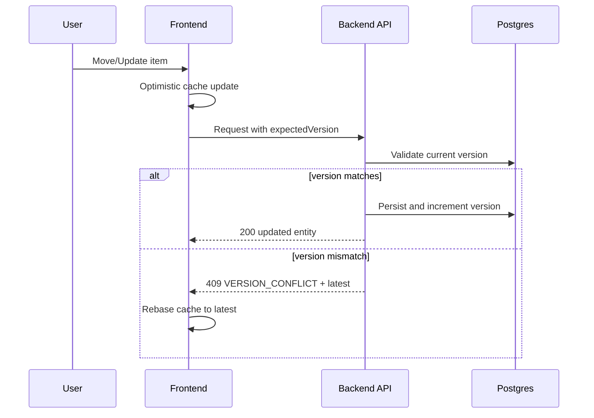
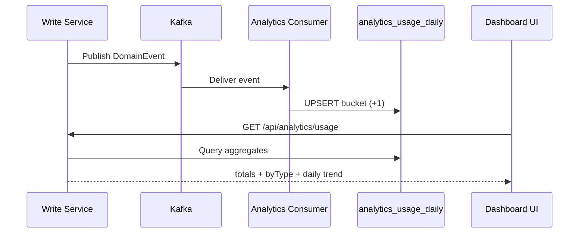

# CollabFlow Master Guide (All-In-One)

This is the single consolidated document that merges:
- Deep implementation explanation
- Interview prep Q and A
- Team onboarding playbook
- README-style architecture and diagrams

Use this one file as your source of truth.

---

## Part A: Implementation Guide (Simple + Deep)

## A1) Executive Summary

We implemented two major platform upgrades:

1. Collaboration safety + speed
- Optimistic UI for instant interactions
- Version-based conflict detection and resolution for concurrent edits

2. Search + analytics read layers
- OpenSearch/Elasticsearch document index for discovery
- Event-driven analytics aggregate table for dashboard reporting

Business outcome:
- Faster-feeling collaboration
- No silent overwrite of teammate changes
- Better discovery of tasks/projects/activity
- Better product insight through usage metrics

## A2) Explain Like You Are 6

Imagine one big toy city that many kids build together.

The problem:
- You move a toy car to one road.
- Another kid moves the same toy car at the same time.
- One move could erase the other without warning.

The fix:
- Every toy has a version sticker.
- Client says: "I changed version 5".
- Server checks if item is still version 5.
- If yes: accept.
- If no: return newest state and ask client to update.

Why it feels fast:
- UI updates immediately (optimistic UI), then server confirms.

Result:
- Fast user experience + safe collaboration.

## A3) System Design

Write path:
- User action -> API -> transactional write -> publish domain event

Read paths:
1. Search read model
- OpenSearch documents maintained from entity/event changes

2. Analytics read model
- Kafka event stream aggregated into daily counters in Postgres

This is CQRS-lite:
- write model optimized for correctness
- read models optimized for query speed and relevance

## A4) What Was Built

Collaboration upgrade:
- Optimistic cache mutations on frontend
- expectedVersion in task/project mutations
- Server-side version validation
- 409 VERSION_CONFLICT responses with latest object
- Client rebase/rollback behavior

Search layer:
- Unified work-item document model
- Indexing for task/project/activity
- Team-scoped fuzzy search endpoint with type filters

Analytics layer:
- Event-driven daily aggregate table (analytics_usage_daily)
- API for totals, event distribution, and daily trends
- Dashboard widgets for search + usage analytics

## A5) Why This Works

Correctness:
- optimistic concurrency prevents silent lost updates

Performance:
- optimistic UI removes round-trip wait in interactions
- read models avoid expensive transactional query patterns

Scalability:
- search and analytics scale as independent read concerns

Operability:
- conflict is treated as expected domain behavior (409 contract), not server failure

## A6) Core Concepts (Mini Course)

Optimistic UI:
- Update local UI first, reconcile after server response
- Great UX, requires rollback/rebase strategy

Optimistic Concurrency Control:
- Compare expectedVersion with current version
- Reject stale writes with conflict response

HTTP 409 as Contract:
- Structured conflict response enables deterministic recovery

OpenSearch/Elasticsearch:
- Inverted index for fast text search
- Multi-field ranking, fuzziness, filtering

Event-Driven Architecture (Kafka):
- Domain events decouple write path from read model projection

Read Models (CQRS-lite):
- Separate read shape from write shape for performance and maintainability

Flyway Migrations:
- Versioned schema evolution for reliable deployments

React Query Cache Orchestration:
- onMutate, snapshot, rollback/rebase, targeted invalidation

## A7) End-to-End Flow Examples

Task move with conflict:
1. User drags task
2. UI applies optimistic move
3. API receives move + expectedVersion
4. Server validates version
5. If match: persist, emit event, reindex, return updated task
6. If mismatch: 409 with latest task, client rebases

Analytics ingestion:
1. Domain event published
2. Analytics consumer receives event
3. UPSERT increments analytics_usage_daily bucket
4. API reads pre-aggregated values for dashboard

Search query:
1. User searches
2. Frontend calls /api/search with team context
3. Service applies authorization + fuzzy weighted query
4. Returns ranked documents

## A8) Failure Modes and Handling

Concurrent races:
- Handled via 409 conflict + latest payload rebase

Search indexing transient failures:
- Non-blocking logging keeps transactional writes available

Consumer duplicate delivery:
- UPSERT aggregation is tolerant; optional event-id dedupe can strengthen semantics

Network errors during optimistic mutations:
- Snapshot rollback + query invalidation refetch

## A9) Added Files and Purpose

Backend added:
1. src/main/java/com/collabflow/domain/common/exception/VersionConflictException.java
2. src/main/java/com/collabflow/domain/search/model/WorkItemDocument.java
3. src/main/java/com/collabflow/domain/search/repository/WorkItemSearchRepository.java
4. src/main/java/com/collabflow/domain/search/dto/SearchResultItemResponse.java
5. src/main/java/com/collabflow/domain/search/dto/SearchResponse.java
6. src/main/java/com/collabflow/domain/search/service/SearchIndexService.java
7. src/main/java/com/collabflow/domain/search/service/WorkItemSearchService.java
8. src/main/java/com/collabflow/presentation/controller/SearchController.java
9. src/main/java/com/collabflow/domain/analytics/dto/UsageAnalyticsResponse.java
10. src/main/java/com/collabflow/domain/analytics/service/UsageAnalyticsService.java
11. src/main/java/com/collabflow/presentation/controller/AnalyticsController.java
12. src/main/resources/db/migration/V13__add_project_version_for_optimistic_locking.sql
13. src/main/resources/db/migration/V14__add_analytics_usage_daily.sql

Frontend added:
14. src/lib/concurrency.ts
15. src/api/search.ts
16. src/api/analytics.ts
17. src/hooks/useSearch.ts
18. src/hooks/useUsageAnalytics.ts

## A10) Edited Files and Purpose

Backend edited:
- pom.xml
- src/main/resources/application.yml
- src/main/java/com/collabflow/domain/project/model/Project.java
- src/main/java/com/collabflow/domain/project/dto/ProjectResponse.java
- src/main/java/com/collabflow/domain/project/dto/ProjectUpdateRequest.java
- src/main/java/com/collabflow/domain/task/dto/TaskUpdateRequest.java
- src/main/java/com/collabflow/domain/task/dto/TaskMoveRequest.java
- src/main/java/com/collabflow/domain/task/service/TaskService.java
- src/main/java/com/collabflow/domain/project/service/ProjectService.java
- src/main/java/com/collabflow/events/model/DomainEventType.java
- src/main/java/com/collabflow/events/consumer/ActivityFeedEventConsumer.java
- src/main/java/com/collabflow/events/consumer/AnalyticsEventConsumer.java
- src/main/java/com/collabflow/events/consumer/NotificationEventConsumer.java
- src/main/java/com/collabflow/presentation/GlobalExceptionHandler.java
- src/main/java/com/collabflow/presentation/controller/TaskController.java

Frontend edited:
- src/api/tasks.ts
- src/api/projects.ts
- src/hooks/useTasks.ts
- src/hooks/useProjects.ts
- src/components/kanban/TaskDetailDialog.tsx
- src/pages/KanbanWorkspace.tsx
- src/components/EditProjectDialog.tsx
- src/pages/ProjectsList.tsx
- src/pages/ProjectDetails.tsx
- src/pages/Dashboard.tsx
- src/pages/ProfileSettings.tsx

## A11) Validation

- Backend compile successful
- Frontend production build successful

## A12) Tradeoffs

1. Version checks vs full CRDT:
- Chosen: version checks
- Reason: simpler and reliable for kanban/forms domain

2. Read models vs direct transactional querying:
- Chosen: read models
- Reason: better query latency and cleaner scaling path

3. Non-blocking indexing:
- Chosen: do not fail core writes when search index update fails
- Reason: preserve transaction availability

## A13) Suggested Next Steps

1. Add integration tests for 409 conflict contracts.
2. Add index backfill/reindex operation for historical data.
3. Add observability metrics: conflict rate, search p95, consumer lag.
4. Add analytics dedupe keyed by event_id.
5. Improve search relevance tuning and highlighting.

---

## Part B: Interview Prep (Q and A Style)

## B1) 30-Second Pitch

Q: What did you build?
A: I implemented optimistic UI and version-based conflict resolution for concurrent collaboration, plus OpenSearch-based global search and event-driven analytics aggregates for fast dashboards.

Q: Why is it impactful?
A: It improved perceived performance, prevented silent overwrite bugs, and enabled discoverability and usage intelligence.

## B2) Architecture Q and A

Q: How did you handle concurrent edits?
A: Optimistic concurrency via expectedVersion and JPA versioning. Stale writes return 409 VERSION_CONFLICT plus latest state.

Q: Why not CRDT?
A: Version checks match this product’s mutation model with less complexity and lower defect risk.

Q: How is UX still fast?
A: Optimistic cache updates happen immediately; server validation reconciles afterward.

Q: What read model strategy did you use?
A: CQRS-lite: transactional writes + specialized read projections for search and analytics.

## B3) Search Q and A

Q: Why search engine over SQL LIKE?
A: Needed fuzzy matching, weighted relevance, and scalable multi-field text querying.

Q: How did you protect tenant boundaries?
A: Team-based authorization and query filter are both enforced.

## B4) Analytics Q and A

Q: How is dashboard data produced?
A: Kafka domain events are aggregated into analytics_usage_daily via UPSERT.

Q: How would you improve exactly-once behavior?
A: Add event_id dedupe tracking in consumer path.

## B5) Reliability Q and A

Q: Main failure modes?
A:
- stale write conflicts
- transient search indexing failures
- consumer replay duplicates
- network errors during optimistic operations

Q: Mitigations?
A:
- conflict contract + rebase
- non-blocking indexing and retries
- UPSERT-friendly aggregates + optional dedupe
- snapshot rollback + refetch

## B6) Testing Q and A

Q: What tests are most important?
A:
- 409 conflict contract tests
- race condition integration tests
- search authorization tests
- analytics aggregation correctness tests
- optimistic UI rollback/rebase tests

## B7) Whiteboard Answer Structure

1. Problem
2. Approach
3. Architecture
4. Tradeoffs
5. Results
6. Next steps

---

## Part C: Team Onboarding Playbook

## C1) First-Day Setup Checklist

1. Start Postgres.
2. Start Kafka.
3. Start OpenSearch.
4. Run backend (Flyway migrations apply).
5. Run frontend.
6. Verify conflict handling/search/analytics endpoints.

## C2) Mental Model for New Engineers

Write path:
- API writes + events

Read paths:
- Search projection
- Analytics projection

Consistency:
- Strong on transactional writes
- Eventual on read models

## C3) Operational Runbooks

Conflict spike:
- Check conflict rates and hotspots
- Verify client rebase logic and stale usage patterns

Search stale results:
- Check indexer logs and cluster health
- run reindex/backfill if needed

Analytics mismatch:
- Check consumer lag/restarts
- validate UPSERT behavior
- evaluate dedupe enhancement

## C4) Change Playbooks

Add new domain event:
1. Add enum value
2. Publish from write service
3. Update consumers (notification/activity/analytics/search)
4. Add integration tests

Add searchable field:
1. Extend document model
2. Populate during indexing
3. Include in query weighting
4. Reindex data

Add analytics dimension:
1. Extend aggregate schema
2. Update consumer aggregation
3. Update API and dashboard
4. Add test coverage

## C5) Test and Release Gate

Before merge:
- Backend compile/tests pass
- Frontend build/tests pass
- Conflict/search/analytics integration checks pass

Recommended resilience checks:
- parallel update race tests
- consumer restart replay tests
- search backfill smoke tests

## C6) Ownership Suggestions

- Collaboration consistency: frontend mutation + API update paths
- Search: indexing/query relevance owners
- Analytics: consumer/aggregate/dashboard owners
- Platform reliability: observability and infra owners

## C7) 30-Day Onboarding Milestones

Week 1:
- Run and trace one task update end-to-end

Week 2:
- Add one event propagation improvement

Week 3:
- Ship one search or analytics enhancement

Week 4:
- Present architecture walkthrough to team

---

## Part D: README Style (With Diagrams)

## D1) Overview

This implementation delivers:
- Fast, optimistic collaboration interactions
- Conflict-safe concurrent write behavior
- Searchable knowledge graph across work items
- Analytics insights from event streams

## D2) Architecture Diagram

```mermaid
flowchart LR
    U[User] --> FE[Frontend React + React Query]
    FE --> API[Spring Boot API]

    API --> DB[(Postgres Transactional Tables)]
    API --> EV[Domain Events]

    EV --> ACT[Activity Consumer]
    EV --> ANA[Analytics Consumer]
    EV --> NOTIF[Notification Consumer]

    API --> IDX[Index Service]
    ACT --> IDX

    IDX --> OS[(OpenSearch Index\ncollabflow-work-items)]
    ANA --> AGG[(analytics_usage_daily)]

    FE -->|Search| SAPI[/api/search]
    SAPI --> OS

    FE -->|Analytics| AAPI[/api/analytics/usage]
    AAPI --> AGG
```

## D3) Conflict Flow Diagram



## D4) Analytics Flow Diagram



## D5) API Contracts Summary

Conflict response:
- status: 409
- code: VERSION_CONFLICT
- expectedVersion
- currentVersion
- latest

Search endpoint:
- GET /api/search
- params: teamId, q, types, limit

Analytics endpoint:
- GET /api/analytics/usage
- params: teamId, projectId optional, days

## D6) Local Run

1. Start Postgres, Kafka, OpenSearch
2. Start backend
3. Start frontend
4. Validate conflict, search, and analytics paths

## D7) Future Improvements

1. Backfill and periodic reindex jobs
2. Analytics dedupe by event_id
3. Search relevance tuning and highlighting
4. Observability dashboards for conflict/search/consumer metrics

---

## Final One-Line Memory Hook

Fast UI for humans, strict versions for safe collaboration, and event-powered read models for scalable search and analytics.
