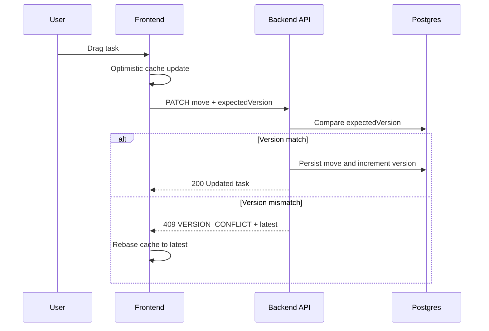
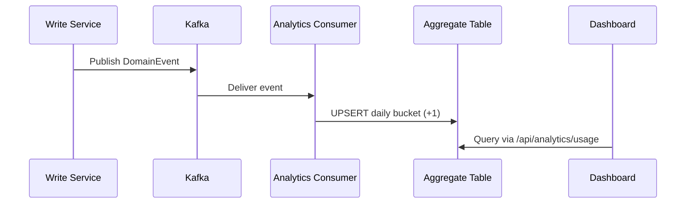

# CollabFlow Collaboration + Search + Analytics Upgrade

Production-style implementation of:
- Optimistic UI with conflict-safe concurrent edits
- OpenSearch/Elasticsearch-powered search
- Event-driven analytics read model

## Table of Contents

- Overview
- Architecture Diagram
- Key Features
- Tech Stack and Patterns
- API Contracts
- Data Models
- End-to-End Flows
- Local Run Guide
- Validation
- Future Improvements

---

## Overview

This upgrade improves three critical product capabilities:

1. Collaboration UX
- Instant UI updates through optimistic caching
- Safe concurrent writes with version checks and conflict responses

2. Discoverability
- Fast cross-entity search over tasks, projects, and activity
- Fuzzy matching and relevance-oriented field weighting

3. Product intelligence
- Event-driven usage analytics optimized for dashboard queries

---

## Architecture Diagram

```mermaid
flowchart LR
    U[User] --> FE[Frontend React + React Query]
    FE --> API[Spring Boot API]

    API --> DB[(Postgres Transactional Tables)]
    API --> EV[Domain Events]

    EV --> ACT[Activity Consumer]
    EV --> ANA[Analytics Consumer]
    EV --> NOTIF[Notification Consumer]

    API --> IDX[Index Service]
    ACT --> IDX

    IDX --> OS[(OpenSearch Index\ncollabflow-work-items)]
    ANA --> AGG[(analytics_usage_daily)]

    FE -->|Search| SAPI[/api/search]
    SAPI --> OS

    FE -->|Analytics| AAPI[/api/analytics/usage]
    AAPI --> AGG
```

---

## Key Features

### Real-time collaboration safety
- expectedVersion included in update requests
- server-side optimistic version validation
- 409 VERSION_CONFLICT with latest server object
- client rollback/rebase strategy for deterministic recovery

### Search layer
- indexed document model for task/project/activity
- team-scoped authorization filtering
- weighted multi-field fuzzy search
- recency-aware sorting

### Analytics layer
- event-driven UPSERT into daily aggregate table
- API with totals, event breakdown, and daily trend points
- dashboard visual section for usage insights

---

## Tech Stack and Patterns

### Backend
- Spring Boot
- Spring Data JPA
- Spring Data Elasticsearch
- Kafka consumers/publishers
- Flyway migrations

### Frontend
- React
- TanStack React Query
- Optimistic mutation cache orchestration

### Data and Infra
- Postgres
- OpenSearch/Elasticsearch
- Kafka

### Patterns
- Optimistic UI
- Optimistic concurrency control
- Event-driven architecture
- Read model projection (CQRS-lite)

---

## API Contracts

### Conflict contract

When stale updates occur:
- HTTP 409
- code: VERSION_CONFLICT
- expectedVersion
- currentVersion
- latest object for client rebase

### Search API

Endpoint:
- GET /api/search

Params:
- teamId
- q
- types (optional)
- limit (optional)

### Analytics API

Endpoint:
- GET /api/analytics/usage

Params:
- teamId
- projectId (optional)
- days (default 30)

---

## Data Models

### Search index document
- resourceType
- resourceId
- teamId
- projectId
- title
- description
- taskListName
- actorUsername
- assignees
- priority
- completed
- updatedAt
- occurredAt

### Analytics aggregate table
Primary key:
- day
- team_id
- project_id
- event_type

Measure:
- event_count

---

## End-to-End Flows

### Task move with conflict handling



### Analytics ingestion



---

## Local Run Guide

1. Start Postgres, Kafka, and OpenSearch.
2. Start backend service and allow Flyway migrations.
3. Start frontend.
4. Validate:
- concurrent edit conflict behavior
- search returns team-scoped results
- analytics endpoint returns totals and trends

---

## Validation

Build checks completed:
- backend compile successful
- frontend production build successful

---

## Future Improvements

1. Add conflict contract integration tests.
2. Add index backfill/reindex endpoint.
3. Add analytics event-id dedupe for strict idempotency.
4. Add search relevance tuning and highlighting.
5. Add observability dashboards for conflict rate, search latency, and consumer lag.
